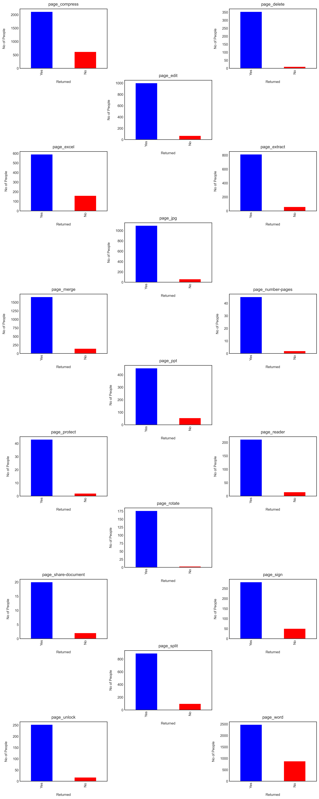
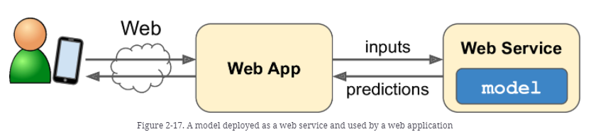
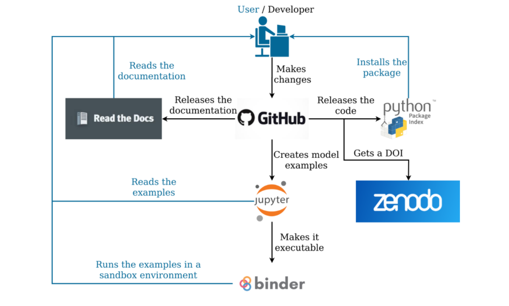

# engageclients
mmm ...

## A. Exercise #1

#### Based on the information provided, What are some of the biggest drivers of retention and engagement? Why?
1. Desktop applications have much better retention rates
2. Linux OS has similar users compared to IOS and Android, but with higher retention
Therefore I conclude that users with personal computers have better interaction with the product

## B. Exercise #2
mmm ...

## C. Discussion

### C.1. Web App
mmm ...

### C.2. Release flow
mmm ...

## Contributing

To contribute follow these steps:

1. Fork the project on GitHub.
2. Create a local clone of the develop branch (`git clone https://github.com/YOUR-USERNAME/engageclients.git -b develop`)
3. Install the packages in `engageclients/requirements/env_engageclients.yml` and `engageclients/requirements/env_developer.yml`.
4. Make well commented and clean commits to your repository.
5. Make unit and integration tests on your code, preferably during development.
6. Perform a static code analysis of your code with ENGAGECLIENTS's configuration `.pylintrc`.
7. Add your name to the AUTHORS file.
8. Push the changes to GitHub (`git push origin develop`).
9. On GitHub, create a new pull request onto the develop branch of CLIENTS-project/engageclients.

See our [contribution guidelines](http://www.saeidashraf.com/) for more information.

## Versioning

We use [SemVer](http://semver.org/) for versioning. For the versions available, see the [releases on this repository](https://github.com/engageclients/releases).

## License

Copyright (C) 2021 saeidashraf, engageclients contributors listed in AUTHORS.

engageclients is free software: you can redistribute it and/or modify it under the terms of the GNU General Public License Version 3, 29 June 2007 as published by the Free Software Foundation, https://www.gnu.org/licenses/gpl-3.0.html

engageclients is distributed in the hope that it will be useful, but WITHOUT ANY WARRANTY; without even the implied warranty of MERCHANTABILITY or FITNESS FOR A PARTICULAR PURPOSE. See the GNU General Public License for more details: https://www.gnu.org/licenses/gpl-3.0.html
