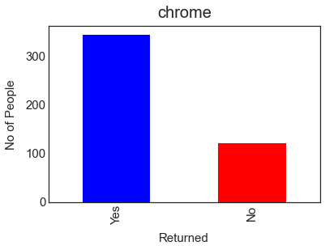

# engageclients

This repository includes the answers to the two tasks of the data scientist challenge.  
It is designed in a way that one can classify if a user would be loyal or not. There are two models to suggest new pages and products to users.

The new Tensorflew Recommendation API has been utilized to develop the recommender system.

# A. Exercise #1

#### Based on the information provided, What are some of the biggest drivers of retention and engagement? Why?

1. Desktop applications have much better retention rates
2. Linux OS has similar users compared to IOS and Android, but with higher retention
Therefore I conclude that users with personal computers have better interaction with the product

## First Run of Visualization

#### Retention of all instances based on the page feature

#### Retention of all instances based on the os feature

#### Retention of all instances based on the browser featur

#### Retention of all instances based on the browser feature

## Second Run of Visualization

#### Retention of Unique Clients based on the chrome browser feature

#### Retention of Unique Clients based on the chrome browser feature

#### Retention of Unique Clients based on the Firefox browser feature

#### Retention of Unique Clients based on the chrome IE feature

#### Retention of Unique Clients based on the Opera browser feature

#### Retention of Unique Clients based on the Safari browser feature

#### Retention of Unique Clients based on the Android OS feature

#### Retention of Unique Clients based on the IOS OS feature

#### Retention of Unique Clients based on the Linux OS feature

#### Retention of Unique Clients based on the Mac OS feature

#### Retention of Unique Clients based on the Windows OS feature

#### Retention of Unique Clients based on the Monthly Plan feature

#### Retention of Unique Clients based on the Yearly Plan feature

#### Retention of Unique Clients based on the pages feature

# B. Exercise #2
mmm ...

## C. Discussion

### C.1. Web App
mmm ...

### C.2. Release flow
mmm ...

## Contributing

To contribute follow these steps:

1. Fork the project on GitHub.
2. Create a local clone of the develop branch (`git clone https://github.com/YOUR-USERNAME/engageclients.git -b develop`)
3. Install the packages in `engageclients/requirements/env_engageclients.yml` and `engageclients/requirements/env_developer.yml`.
4. Make well commented and clean commits to your repository.
5. Make unit and integration tests on your code, preferably during development.
6. Perform a static code analysis of your code with ENGAGECLIENTS's configuration `.pylintrc`.
7. Add your name to the AUTHORS file.
8. Push the changes to GitHub (`git push origin develop`).
9. On GitHub, create a new pull request onto the develop branch of CLIENTS-project/engageclients.

See our [contribution guidelines](http://www.saeidashraf.com/) for more information.

## Versioning

We use [SemVer](http://semver.org/) for versioning. For the versions available, see the [releases on this repository](https://github.com/saeedashraf/engageclients).

## License

Copyright (C) 2021 saeidashraf, engageclients contributors listed in AUTHORS.

engageclients is free software: you can redistribute it and/or modify it under the terms of the GNU General Public License Version 3, 29 June 2007 as published by the Free Software Foundation, https://www.gnu.org/licenses/gpl-3.0.html

engageclients is distributed in the hope that it will be useful, but WITHOUT ANY WARRANTY; without even the implied warranty of MERCHANTABILITY or FITNESS FOR A PARTICULAR PURPOSE. See the GNU General Public License for more details: https://www.gnu.org/licenses/gpl-3.0.html
